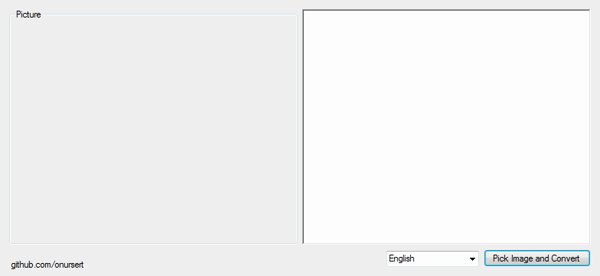

# Optical Character Recognition

Optical Character Recognition (with MODI) - 2014 (C#)

Optical Character Recognition is a tool for Windows PCs that allows you to scan a document and convert it to editable text.

The interface consists of a screen that allows you to upload a picture that contains English, German or Turkish text and convert it to editable text. This app uses <a href="https://support.microsoft.com/en-us/help/982760/install-modi-for-use-with-microsoft-office-2010">Microsoft Office Document Imaging (MODI)</a> for OCR process.

Optical Character Recognition app doesn't require installation.

<a href="https://github.com/onursert/OpticalCharacterRecognition/raw/master/OpticalCharacterRecognition.exe">Download Optical Character Recognition</a>
